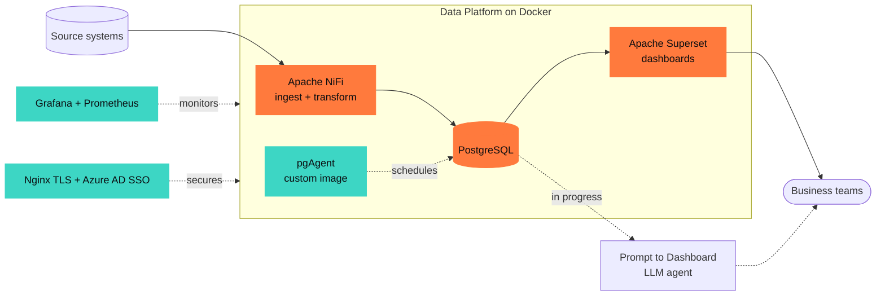
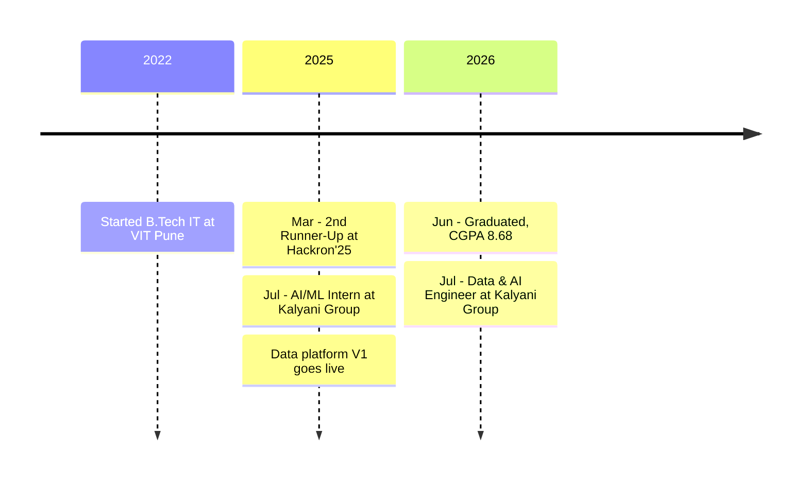

  

  

  
  
  
  
  

  Data & AI Engineer on the Data Platform team at the <b>Kalyani Group</b>, Pune. 
  I joined as an AI/ML intern, took the group's data platform from research to production, 
  and now run it full time. B.Tech IT, VIT Pune (CGPA 8.68).

  

  
  
  
  
  

  

<b>The platform I built</b> &nbsp;·&nbsp; click to expand

 

Live in **5 production environments** across the group, replacing paid SaaS tools.

| | |
|---|---|
| **1.4 TB → 18 GB** | Archived IoT production data for a team that was running out of storage |
| **pgAgent in Docker** | Built the image myself; no official one existed |
| **Azure AD SSO** | OAuth 2.0 / OIDC sign-in for Superset, with users mapped to Superset roles |
| **Config Manager** | Generates each deployment's configuration from a few inputs |
| **Encrypted Compose** | A unique key per deployment, kept out of shell history |

<b>Projects</b> &nbsp;·&nbsp; click to expand

 

| Project | What it does | Stack |
|---|---|---|
| [**myportfolio**](https://github.com/sujitwagh9/myportfolio) | Portfolio with an AI assistant, job-fit analyzer and semantic search | Next.js, TypeScript, Gemini |
| [**Pneumonia Detection**](https://github.com/sujitwagh9/Pneumonia-Detection-and-Report-Generation) | Detects pneumonia from chest X-rays and writes a report, with heatmaps | Python, CNN, Flask |
| **Dark Store Network** | Plans dark-store placement with demand clustering and Voronoi maps | Next.js, Flask, MongoDB |
| [**CampusFound**](https://github.com/sujitwagh9/CampusFound) | Report, track and claim lost and found items on campus | JavaScript, Node.js |
| [**Anomaly Detector**](https://github.com/sujitwagh9/anamoly-detector) | Finds anomalies in time-series data | Python, ML |
| [**KrishiSetu**](https://github.com/sujitwagh9/KrishiSetu) | Connects farmers directly to the market | JavaScript |

<b>Achievements</b> &nbsp;·&nbsp; click to expand

 

| | |
|---|---|
| **Hackron'25** (Blinkit) | 2nd Runner-Up · ₹10,000 · Dark Store Network Projection System |
| **Vodafone Idea Tech Marathon** | Winner · ₹25,000 · threat-analysis dashboard built in 90 minutes |
| **Kalyani Group Hackathon** | Winner · one of the top 7 applicants selected for an internship |
| **LeetCode Weekly Contest 428** | Global rank 737 out of 24K+ |
| **Ratings** | LeetCode 1550 · GeeksforGeeks 3★ · CodeChef 2★ |

<b>Timeline</b> &nbsp;·&nbsp; click to expand

 

  

