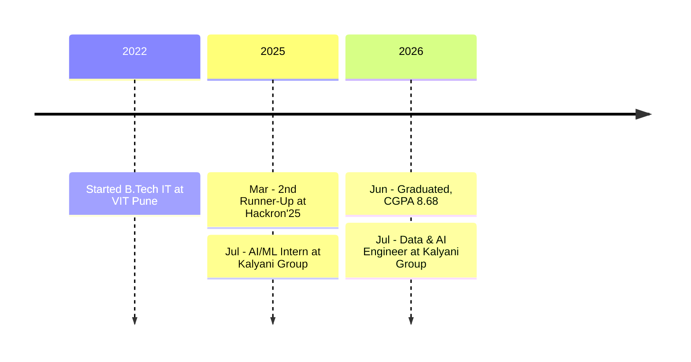

  

  
  
  

  
  
  
  
  

  Engineer who likes taking an idea from a blank file to something running. 
  I work across ML, backend and frontend, and I enjoy problems where those meet. 
  By day I'm a <b>Data &amp; AI Engineer at the Kalyani Group</b>. <i>B.Tech IT, VIT Pune (CGPA 8.68).</i>

 

## ⚡ At a glance

<table align="center">
  <tr>
    <td align="center" width="25%"><h3>🧱 18</h3>public repos and counting</td>
    <td align="center" width="25%"><h3>🏆 3</h3>hackathon wins &amp; podiums</td>
    <td align="center" width="25%"><h3>🌍 #737</h3>LeetCode Weekly 428 out of 24K+</td>
    <td align="center" width="25%"><h3>🦈 Pull Shark</h3>GitHub achievement unlocked</td>
  </tr>
</table>

 

## 🧰 Tech arsenal

  

  
  
  
  
  

 

## 🚀 Featured projects

<table>
  <tr>
    <td width="50%" valign="top">
      <h3>🫁 <a href="https://github.com/sujitwagh9/Pneumonia-Detection-and-Report-Generation">Pneumonia Detection</a></h3>
      Reads a chest X-ray, flags pneumonia, highlights the evidence with heatmaps and writes up a report.  
        
    </td>
    <td width="50%" valign="top">
      <h3>🐦 <a href="https://github.com/sujitwagh9/Animal-Species-Prediction">Animal Species &amp; Pain Detection</a></h3>
      Classifies bird species and spots signs of distress in animal sounds, using MobileNetV2 on spectrograms and MFCC features.  
        
    </td>
  </tr>
  <tr>
    <td width="50%" valign="top">
      <h3>📍 Dark Store Network</h3>
      Plans where dark stores should go using demand clustering and Voronoi maps. <b>2nd Runner-Up at Hackron'25 (Blinkit).</b>  
        
    </td>
    <td width="50%" valign="top">
      <h3>🧑‍💻 <a href="https://github.com/sujitwagh9/myportfolio">myportfolio</a></h3>
      A portfolio that talks back: AI assistant, job-fit analyzer and semantic search.  
        
    </td>
  </tr>
</table>

<b>More things I've built</b> &nbsp;·&nbsp; click to expand

 

| Project | What it does | Stack |
|---|---|---|
| [**Course-Aid**](https://github.com/sujitwagh9/Course-Aid) | Learning management system: students enroll, ask instructors doubts and track progress; instructors upload courses |  |
| [**CampusFound**](https://github.com/sujitwagh9/CampusFound) | Report, track and claim lost and found items on campus |   |
| [**Anomaly Detector**](https://github.com/sujitwagh9/anamoly-detector) | Finds anomalies in time-series data |   |
| [**KrishiSetu**](https://github.com/sujitwagh9/KrishiSetu) | Connects farmers directly to the market |  |
| [**BloodBank**](https://github.com/sujitwagh9/BloodBank) | Static website for a blood bank |  |

 

##  GitHub stats

  
  

  

### Contribution graph

  

### Contribution snake

  <picture>
    <source media="(prefers-color-scheme: dark)" srcset="https://raw.githubusercontent.com/sujitwagh9/sujitwagh9/output/github-snake-dark.svg" />
    <source media="(prefers-color-scheme: light)" srcset="https://raw.githubusercontent.com/sujitwagh9/sujitwagh9/output/github-snake.svg" />
    
  </picture>

 

## Wins &amp; milestones

<table align="center">
  <tr>
    <td align="center" width="25%"><h3>🥉</h3><b>Hackron'25</b> Blinkit 2nd Runner-Up · ₹10,000</td>
    <td align="center" width="25%"><h3>🥇</h3><b>Vodafone Idea Tech Marathon</b> Winner · ₹25,000 dashboard in 90 min</td>
    <td align="center" width="25%"><h3>🥇</h3><b>Kalyani Group Hackathon</b> Winner · top 7 picked for an internship</td>
    <td align="center" width="25%"><h3>🌍</h3><b>LeetCode Weekly 428</b> Global rank 737 out of 24K+</td>
  </tr>
</table>

  

LeetCode 1550 · GeeksforGeeks 3★ · CodeChef 2★

 

## 🛤️ Journey

 

## 🔭 Right now

<table align="center">
  <tr>
    <td width="33%" valign="top"><h4>🔨 Building</h4>LLM agents and MCP tools that let people talk to their data in plain English.</td>
    <td width="33%" valign="top"><h4>📚 Learning</h4>Agent design, deeper ML, and shipping models behind clean APIs.</td>
    <td width="33%" valign="top"><h4>💬 Ask me about</h4>Hackathon strategy, ML projects, full-stack builds, and LeetCode.</td>
  </tr>
</table>

 

  

  

